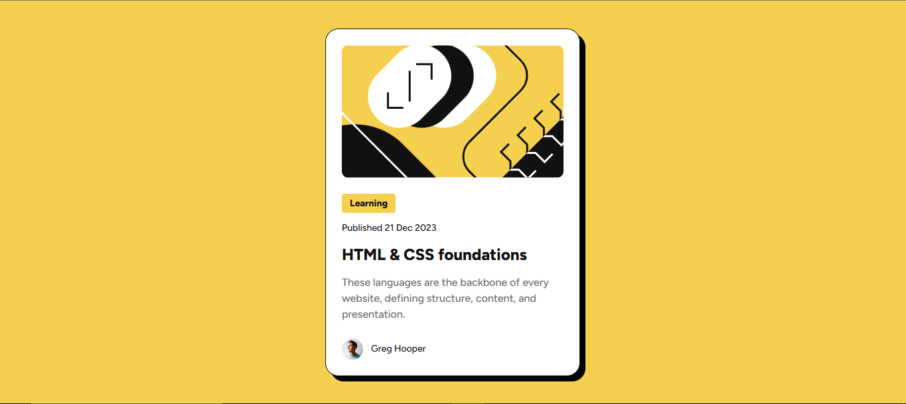

# Frontend Mentor - Blog preview card solution

This is a solution to the [Blog preview card challenge on Frontend Mentor](https://www.frontendmentor.io/challenges/blog-preview-card-ckPaj01IcS). Frontend Mentor challenges help you improve your coding skills by building realistic projects.

## Table of contents

- [Overview](#overview)
  - [The challenge](#the-challenge)
  - [Screenshot](#screenshot)
  - [Links](#links)
- [My process](#my-process)
  - [Built with](#built-with)
  - [What I learned](#what-i-learned)
  - [Continued development](#continued-development)
  - [Useful resources](#useful-resources)
- [Author](#author)
- [Acknowledgments](#acknowledgments)

## Overview

### The challenge

Users should be able to:

- See hover and focus states for all interactive elements on the page

### Screenshot



### Links

- Solution URL: [Add solution URL here](https://github.com/ernur-burshak/Blog-Preview-Card)
- Live Site URL: [Add live site URL here](https://ernur-burshak.github.io/Blog-Preview-Card/)

## My process

### Built with

- Semantic HTML5 markup
- CSS custom properties
- Flexbox
- Mobile-first workflow

### What I learned

```css
@font-face {
  font-family: "Figtree";
  font-weight: 500, 800;
  src: url("../assets/fonts/Figtree-VariableFont_wght.ttf") format("truetype");
}
```

```css
.container-main-image {
  background-image: url("../assets/images/illustration-article.svg");
}
```

```css
.learning-text {
  width: fit-content;
}
```

- In this task, I also knew how to work with svg images.

### Continued development

- Mobile-first workflow
- Bootstrap

### Useful resources

- [resource 1](https://github.com/finkusuma-dev/frontendmenter-blog-preview-card) - This resource helped me because of the font usage.
- [resource 2](https://www.frontendmentor.io/community) - This is the link for our Discord community for Frontend mentor.

## Author

- Website - [Ernur](https://ernur-burshak.github.io/Blog-Preview-Card/)
- Frontend Mentor - [@ernur-burshak](https://www.frontendmentor.io/profile/ernur-burshak)

## Acknowledgments

I want to thank k https://github.com/finkusuma-dev . He helped me use fonts correctly.
